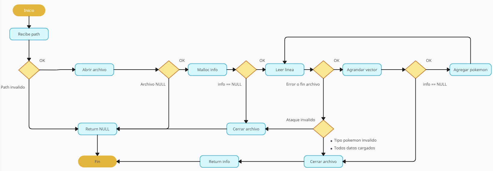
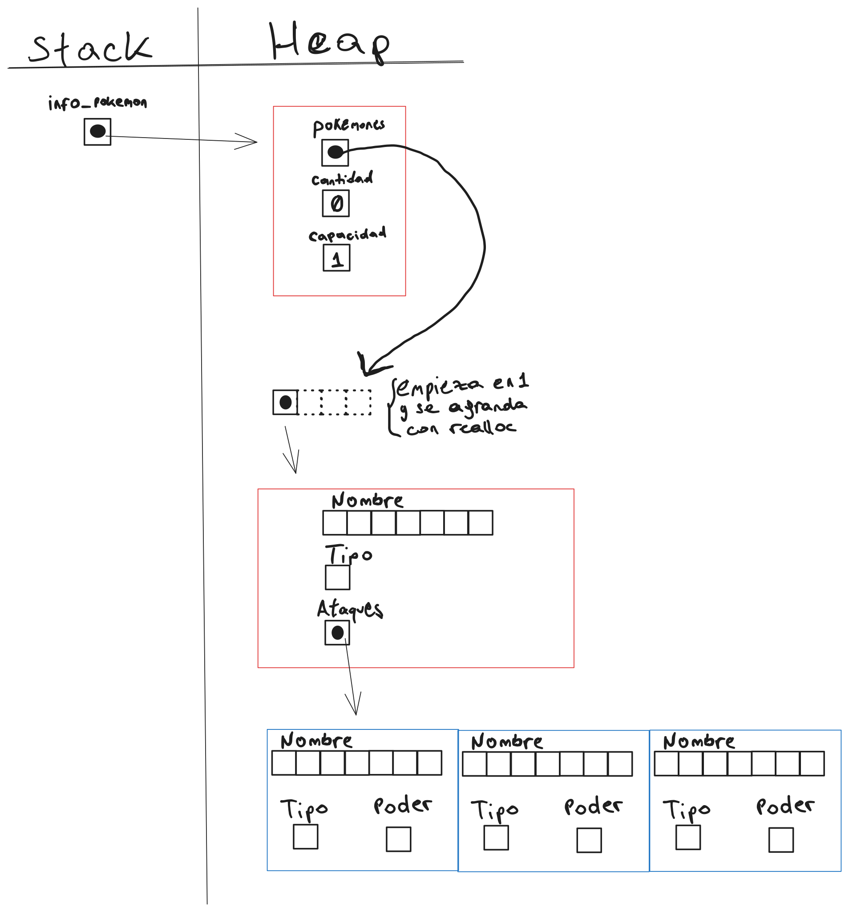
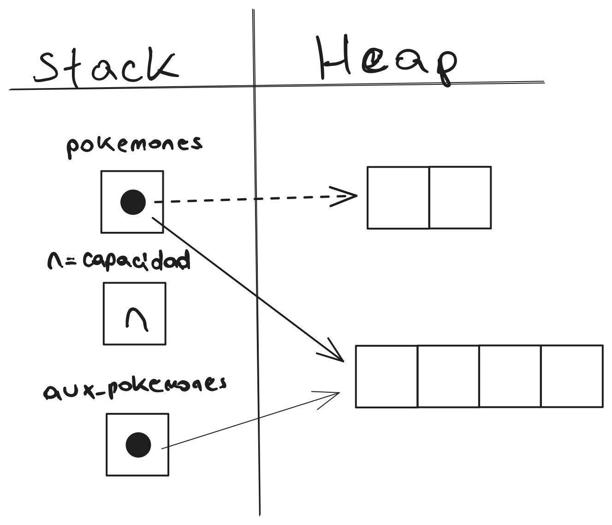

<div align="right">

</div>

# TP1

## Repositorio de Lucas Aldonate - 100030 - laldonate@fi.uba.ar

- Para compilar:

```bash
make pruebas_chanutron
```

- Para ejecutar:

```bash
./pruebas_chanutron
```

- Para ejecutar con valgrind:
```bash
make valgrind-chanutron
```
---
##  Funcionamiento

### Función principal:

El programa recibe un archivo el cuál intenta abrir en caso de ser válido. Si se logra abrir, se aloja memoria para el vector de pokemones. Se lee linea por linea
guardando los valores de cada linea en cada iteración, se guardan dichos datos en el vector en caso de ser posible y en caso contrario se utiliza un realloc 
(el cuál a su vez utiliza una variable auxiliar en caso de fallos), para agrandar el vector y poder seguir guardando los datos de los pokemones. El programa
continua siempre y cuando no se encuentren errores o hasta llegar al final del archivo.

<div align="center">

</div>

### Funciones auxiliares:

Aparte de la función principal, se crearon 4 funciones aparte. Dos de ellas se utilizan para finalizar el programa, liberar la memoria y retornar NULL (en caso de que
los ataques sean inválidos) o el vector (en caso de que algun tipo de pokemon/ataque sea inválido). Se creó una función para determinar el tipo de pokemon/ataque
dependiendo de lo leído en el archivo y por último una función de ordenamiento (Bubble Sort), para ordenar alfabéticamente el vector de pokemones. Esta última 
utiliza una función que simplemente sirve para intercambiar dos valores en el vector.
A continuación se listan dichas funciones:

- Función para ataques inválidos:
```c
informacion_pokemon_t *ataques_invalidos(informacion_pokemon_t *ip,
					 FILE *archivo)
{
	fclose(archivo);
	for (int k = 0; k < 3; k++) {
		free(ip->pokemones[ip->cantidad]->ataques[k]);
	}
	free(ip->pokemones[ip->cantidad]);
	free(ip->pokemones);
	free(ip);
	return NULL;
}
```

- Función para tipo inválido:
```c
informacion_pokemon_t *tipo_invalido(informacion_pokemon_t *ip, FILE *archivo)
{
	fclose(archivo);
	for (int k = 0; k < 3; k++) {
		free(ip->pokemones[ip->cantidad]->ataques[k]);
	}
	free(ip->pokemones[ip->cantidad]);
	return ip;
}
```

- Función para determinar tipo:
```c
enum TIPO tipo_pokemon(const char tipo)
{
	switch (tipo) {
	case 'N':
		return NORMAL;
	case 'F':
		return FUEGO;
	case 'A':
		return AGUA;
	case 'P':
		return PLANTA;
	case 'E':
		return ELECTRICO;
	case 'R':
		return ROCA;
	default:
		return -1;
	}
}
```

- Función para intercambiar posición:
```c
void cambiar_posicion(pokemon_t *xp, pokemon_t *yp)
{
	pokemon_t temp = *xp;
	*xp = *yp;
	*yp = temp;
}

```

- Función de ordenamiento `bubble_sort`:
```c
void bubble_sort(pokemon_t **pokemones, int cantidad)
{
	int i, j;
	int es_mayor;
	bool cambio;
	for (i = 0; i < cantidad - 1; i++) {
		cambio = false;
		for (j = 0; j < cantidad - i - 1; j++) {
			es_mayor = strcmp(pokemones[j]->nombre,
					  pokemones[j + 1]->nombre);
			if (es_mayor > 0) {
				cambiar_posicion(pokemones[j],
						 pokemones[j + 1]);
				cambio = true;
			}
		}

		if (cambio == false)
			break;
	}
}
```

### Variables auxiliares:

Para determinar los distintos tipos (tanto de ataques como de pokemon), se 
utilizan variables auxiliares:

```c
char aux_tipo_pokemon[20];

char aux_tipo_ataques[MAX_ATAQUES][20];
```

Dichas variables almacenan temporalmente el caracter leído para luego ser pasadas como parametro a la función `tipo_pokemon` con el fin de determinar el tipo. Ejemplo:

```c
leidos = sscanf(linea, "%[^;];%[^;]",
        info->pokemones[info->cantidad]->nombre,
        aux_tipo_pokemon);

if (leidos != 2) {
    fclose(archivo);
    return info;
}

info->pokemones[info->cantidad]->tipo =
    tipo_pokemon(aux_tipo_pokemon[0]);
```

Por otro lado, también se utiliza una variable auxiliar a la hora de utilizar realloc, para prevenir el caso de que realloc falle. Ejemplo:

```c
if (info->cantidad >= info->capacidad) {
    info->capacidad *= 2;
    pokemon_t **aux_pokemones =
        realloc(info->pokemones,
            info->capacidad * sizeof(pokemon_t *));

    if (info->pokemones == NULL) {
        fclose(archivo);
        free(info->pokemones);
        return info;
    }

info->pokemones = aux_pokemones;
}
```

### Diagramas de memoria:

En el siguiente diagrama se observa como se comporta en memoria la estructura principal del programa (info_pokemon). Vemos que la estructura
se inicializa con una cantidad de 0 y una capacidad de 1 (la cuál irá aumentando a medida que agrandemos el vector con realloc). Esta estructura
posee un puntero doble a pokemones, en el cual cada puntero de dicho vector apunta a un pokemon distinto con tres ataques cada uno.

<div align="center">

</div>

En cuanto al uso de realloc, el programa verifica cada vez que se quiera proceder a leer un pokemon para luego insertarlo en el vector, si la 
capacidad actual lo permite, caso contrario, se utiliza realloc para agrandar la capacidad al doble de la actual. Se utiliza un vector 
auxiliar ya que es una buena practica a la hora de utilizar esta operación en caso de que realloc falle.

<div align="center">

</div>

---

## Respuestas a las preguntas teóricas

Respuesta 1:

Para que los pokemon queden ordenados alfabéticamente, se hace uso de la función de ordenamiento "Bubblesort". Su funcionamiento es el siguienteÑ

<div align="center">

</div>

Cabe destacar que en esta implementación de "Bubblesort", se utiliza un break para que sea apenas mas eficiente que la original, ya que en caso
de que el loop interno no se realice ningun swap, quiere decir que la lista ya está ordenada y por ende no hay necesidad de seguir iterando.

Esta función tiene una complejidad algorítmica de O(n^2). La explicación de esto es que por cada iteración del for externo que itera (n-1) veces,
el loop interno itera (n-1-i) veces, siendo i el indice del loop externo. Debido a esto podemos decir que se realizan n operaciones (loop interno)
por cada iteración del loop externo que a su vez tambien se repite n veces. En el infinito podemos decir que tanto (n-1) como (n-1-i) se comportan
como n. Finalmente, n*n o mas bien n^2 nos da por resultado una complejidad algorítmica de O(n^2).


Respuesta 2:

Los diagramas se encuentran desarrollados más arriba.
